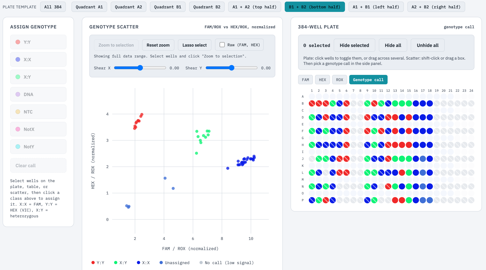

# kasp-cluster
Analyze the KASP plate reader results like KlusterCaller

# Usage
You can download the standalone HTML file and double-click it to open it in a browser. Then just upload your plate reader file for clustering and genotype calling.

I only tested with the output of FLUOstar Omega microplate reader (see the example file "Plate384-reader-output-example.csv"). If it does not work for you, just send me your plate reader file, and I will modify the HTML file to work for your plate reader output files.

You can also use this tool in my webpage:

**Your data is safe. Nothing will be uploaded. Everything is done in your web browser.**

A video tutorial can be found here: https://youtu.be/bYdVu0kH5OQ

